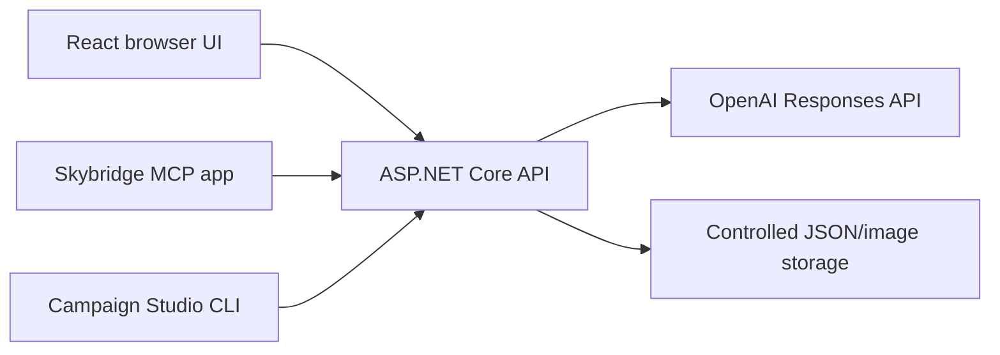

# Campaign Studio

Campaign Studio is a production-oriented ASP.NET Core 10 application that turns a concise campaign brief into:

- one focused campaign concept;
- exactly three headline/body-copy variants;
- an ordered launch checklist;
- two image directions and generated campaign images;
- direct-labeled readiness scores for each requested channel.

It includes a React web interface, a three-tool Skybridge MCP development app, and a composable Node.js CLI.

## Architecture



Only the ASP.NET process calls OpenAI. The browser, MCP view, and CLI never receive `OPENAI_API_KEY`. The implementation uses the Responses API for structured campaign text and its image-generation tool for visuals, following the current [OpenAI model guidance](https://developers.openai.com/api/docs/models) and [image-generation guidance](https://developers.openai.com/api/docs/guides/image-generation). The MCP app follows the current [MCP server](https://developers.openai.com/plugins/build/mcp-server) and [MCP Apps UI](https://developers.openai.com/plugins/build/chatgpt-ui) patterns.

## Prerequisites

- .NET 10 SDK for development
- Node.js 24 and npm
- Windows Server 2022 with IIS and the .NET 10 Hosting Bundle for deployment
- An OpenAI API project with image-generation access

## Local setup

The confirmed development credential is stored in the ignored root `.env.local`. Do not commit it. Export it into the server process before running:

```powershell
$line = Get-Content .env.local | Where-Object { $_ -like 'OPENAI_API_KEY=*' } | Select-Object -First 1
$env:OPENAI_API_KEY = $line.Substring('OPENAI_API_KEY='.Length)
dotnet run --project src/CampaignStudio.Web --urls http://127.0.0.1:5208
```

In a second terminal:

```bash
cd src/CampaignStudio.Web/ClientApp
npm ci
npm run dev
```

Open `http://127.0.0.1:5173`. Add `?demo=1` to review the deterministic design state without API usage.

## Build and test

```bash
dotnet test CampaignStudio.sln

cd src/CampaignStudio.Web/ClientApp
npm ci
npm test
npm run build

cd ../../../../mcp
npm ci
npm run build

cd ../cli
npm test
```

The current Codex workspace has Node.js but no .NET SDK, so the Node, MCP, CLI, and browser checks can run here; `dotnet test` and `dotnet publish` must run on a machine with .NET 10 installed.

## Configuration

| Setting | Default | Purpose |
|---|---:|---|
| `OPENAI_API_KEY` | required | Server-only OpenAI credential |
| `OPENAI_MODEL` | `gpt-5.6` | Mainline Responses model |
| `OpenAI:ReasoningEffort` | `medium` | Campaign reasoning depth |
| `OpenAI:ImageSize` | `1536x1024` | Generated image dimensions |
| `OpenAI:ImageQuality` | `medium` | Image quality/cost balance |
| `OpenAI:ImageCount` | `2` | Images requested per campaign |
| `OpenAI:TimeoutSeconds` | `120` | Upstream request timeout |

Adjust the structured prompt and JSON schema in `Services/OpenAiCampaignService.cs`. Change presentation and sample state in `ClientApp/src`. Channel readiness is deterministic server logic, not model-authored scoring.

## MCP development app

The primary archetype is a React widget backed by focused data tools. Run it after the ASP.NET API:

```bash
cd mcp
npm ci
CAMPAIGN_STUDIO_API_URL=http://127.0.0.1:5208 npm run dev
```

- DevTools: `http://127.0.0.1:3000`
- MCP endpoint: `http://127.0.0.1:3000/mcp`
- Optional internal bearer protection: set `MCP_BEARER_TOKEN` before startup.

For ChatGPT testing, expose the endpoint through a secure HTTPS tunnel, enable Developer Mode, create a plugin/app using the tunneled `/mcp` URL, and refresh the connection after tool metadata changes. Static bearer protection is for internal testing; use OAuth 2.1 for public or user-specific deployments.

## CLI

```bash
cd cli
npm link
campaign-studio help
campaign-studio --json validate --file ../examples/brief.json
campaign-studio generate --file ../examples/brief.json
```

The CLI keeps JSON stdout clean, sends diagnostics to stderr, and refuses to overwrite exports.

## IIS deployment

1. Install IIS and the .NET 10 Hosting Bundle on Windows Server 2022.
2. From a development machine, run `scripts/publish-iis.ps1`.
3. Copy the publish folder to the server.
4. Run `scripts/set-openai-key.ps1` from elevated PowerShell; it prompts securely and stores the key at machine scope.
5. Run `scripts/install-iis.ps1 -PublishPath <publish-folder>`. By default, it configures Campaign Studio as the IIS Default Web Site root. Pass `-ApplicationPath /CampaignStudio` to install beneath the site instead.
6. Bind a valid TLS certificate, require HTTPS, grant the `IIS AppPool\CampaignStudio` identity modify access only to `App_Data`, and recycle the app pool.
7. Verify `/health`, then submit one controlled smoke-test brief.

`web.config` uses in-process `AspNetCoreModuleV2`, caps request bodies, and keeps stdout logging off by default. IIS should terminate TLS. Health checks never call OpenAI or expose configuration.

## Validation and tuning

See [docs/VALIDATION.md](docs/VALIDATION.md) for the automated and manual validation matrix. The approved desktop and mobile design references are in `docs/design` and are treated as the visual contract.
